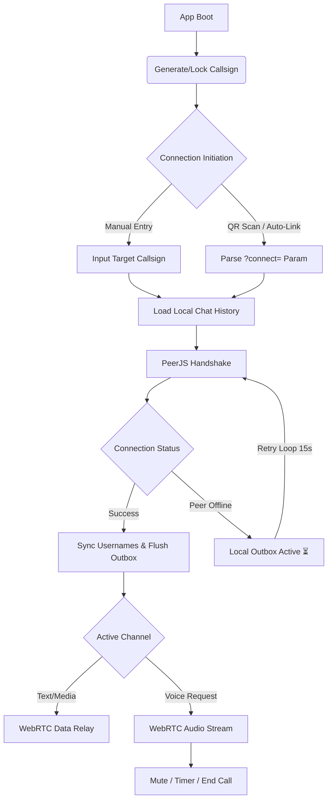

<h1 align="center">DIRECT DROP P2P</h1>
<h3 align="center">Zero-Server Tactical Comms Terminal</h3>

<p align="center">
  A lightweight, serverless peer-to-peer communication tool built for direct, frictionless linking. Exchange callsigns or scan QR codes to establish instant WebRTC text, voice, and media channels. No accounts, no logs, no central server.
</p>

<p align="center">
  
  
  
  
</p>

---

## The Mission: Frictionless Comms

Standard communication platforms rely on central servers, account creation, and data logging. This creates friction and compromises privacy. 

DIRECT DROP P2P acts as a direct tactical relay. By leveraging WebRTC via PeerJS, the application establishes a direct browser-to-browser connection. Users generate a temporary "Callsign," share it via a QR code or manual entry, and instantly spawn a secure text, voice, and media channel. Once the session ends, the link is severed. 

The latest evolution introduces a WhatsApp-like experience—complete with persistent chat history, custom usernames, media sharing, and a local outbox for simulated offline messaging—entirely within the constraints of a pure P2P architecture.

---

## Tactical Features & Engineering Decisions

* **Dual-Layer Identity Protocol:** 
  The app generates a unique 9-character alphanumeric callsign (e.g., `A2B-C4D-E5F`) locked into `localStorage` to serve as the immutable P2P address. On top of this, users can set a custom `Username`. When a connection is established, a profile packet is transmitted, mapping the username to the callsign. The UI dynamically updates to display human-readable names while preserving the underlying technical routing.
* **Local Outbox (Offline Simulation):** 
  True offline messaging requires a backend database, which violates the serverless mandate. To bypass this, the app implements a **Local Outbox**. If a user messages an offline peer, the message is saved to `localStorage` with a `pending` (⏳) state. A background retry loop pings the offline peer every 15 seconds. The moment the peer comes online, the connection establishes, the outbox flushes with original timestamps, and the UI updates to a `sent` (✓) state.
* **Persistent Chat History & Presence:** 
  All messages are saved locally per callsign. When opening a recent connection, the app instantly loads the conversation history. A lightweight presence-check protocol pings peers in the recent list to display online (green) or offline (dim) statuses without requiring a central presence server.
* **Media Relay Engine:** 
  Users can send images and videos directly over the WebRTC data channel. The engine uses the `FileReader` API to convert files to Base64, transmitting them with a 10MB size cap to prevent browser memory exhaustion. Images are rendered inline within the chat UI.
* **Foreground Notification Suite:** 
  To handle background tab scenarios, the app integrates the Web Audio API to generate a subtle "ping" sound on message receipt. It also triggers native device vibration and dynamically updates the browser tab title (e.g., `(1) DIRECT DROP P2P`) to alert the user of unread messages.
* **QR Auto-Link Protocol:** 
  The engine dynamically renders a QR code using a local `qrcode-generator` library. Scanning the code opens the app with a `?connect=` URL parameter. The app parses this parameter on boot and automatically initiates the handshake, bypassing the setup screen entirely.
* **Resilient State Management & Auto-Recovery:** 
  The PeerJS implementation includes a custom error router. If a callsign is already in use globally, it triggers an automatic regeneration of the identity, completely invisible to the user. If the WebRTC peer disconnects, the client automatically attempts a `peer.reconnect()` before throwing a hard error.

---

## Connection Architecture

GitHub natively supports Mermaid.js diagrams. Below is the visual map of how DIRECT DROP P2P establishes a direct peer connection and manages state:



---

## How to Deploy and Use

This application is 100% client-side and is deployed on Vercel. You can deploy your own instance instantly by pushing the code to a GitHub repository and importing it into Vercel.

### 1. Link Up
1. Open the deployed application.
2. Set your **Username** in the identity card.
3. Your unique **Callsign** will be generated automatically. 
4. Share your callsign by clicking **COPY**, or let the other user scan your **QR Code**.
5. Alternatively, the other user can manually enter your callsign into the "Link Up" input field and click **LINK**.

### 2. Establish Comms
1. Once linked, the chat interface will open, displaying the connected peer's username.
2. Type messages into the bottom input bar and hit send. Click the **Attachment (+)** icon to send images or videos.
3. To establish a voice channel, click the **Phone Icon** in the top right. The receiving peer will get an incoming call overlay to **Accept** or **Decline**.
4. If the peer is offline, you can still send messages. They will be marked with a ⏳ icon and auto-delivered when the peer comes online.

### 3. Session Management
* **Recent Connections:** Your previous links are saved on the home screen. Click a callsign to instantly open the chat history and attempt a reconnect.
* **Mute:** Toggle audio transmission during a call using the **MUTE** button.
* **Disconnect:** Open the side menu (top left icon) and click **DISCONNECT** to sever the peer link. 
* **Reset Identity:** If you encounter a callsign conflict, open the settings menu and click **RESET CALLSIGN** to generate a new identity.

---

## Tech Stack

* **PeerJS / WebRTC:** Core engine for peer discovery, data channeling, and direct media streaming.
* **Vanilla JavaScript:** Zero frameworks. All DOM manipulation, local outbox logic, and event handling are written in raw, optimized JS.
* **Vanilla CSS:** Custom tactical dark-mode styling with CSS variables, `clip-path` geometrics, and CRT overlays.
* **Web APIs:** Utilizes `localStorage` for state/history, `FileReader` for media encoding, `navigator.vibrate` for alerts, and the Web Audio API for notification sounds.
* **QRCode Generator:** Local generation of connection QR codes without external API calls.
```
