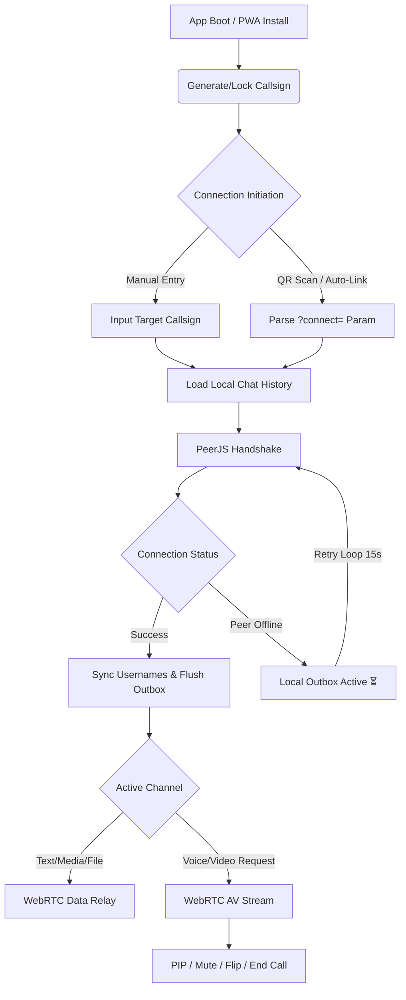

<h1 align="center"> DIRECT DROP P2P</h1>
<h3 align="center">Zero-Server Tactical Comms Terminal</h3>

  A lightweight, serverless peer-to-peer communication tool built for direct, frictionless linking. Exchange callsigns or scan QR codes to establish instant WebRTC text, voice, video, and media channels. No accounts, no logs, no central server.

  
  
  
  

---

## The Mission: Frictionless Comms

Standard communication platforms rely on central servers, account creation, and data logging. This creates friction and compromises privacy. 

DIRECT DROP P2P acts as a direct tactical relay. By leveraging WebRTC via PeerJS, the application establishes a direct browser-to-browser connection. Users generate a temporary "Callsign," share it via a QR code or manual entry, and instantly spawn a secure text, voice, and media channel. Once the session ends, the link is severed.

### The Evolution: How We Got Here
This project was engineered entirely on a mobile-first developer environment (Termux + GitHub CLI on an Android tablet), which heavily influenced our architectural decisions:

1. **The TWA/APK Abandonment:** We initially built a Capacitor GitHub Action to compile an Android APK (TWA) to distribute the app. However, Android's generic WebView restrictions broke native sharing and background notifications. We pivoted to a **pure Progressive Web App (PWA)** architecture. By registering a Service Worker and a Web Manifest, Chrome natively installs the app on the home screen with *full, unbridled access* to native Android APIs (Share Sheet, Notifications, Wake Lock) without needing an APK wrapper.
2. **Media Handling Reversion:** We experimented with complex WebRTC chunking and backpressure for file transfers to create a WhatsApp-style blur-to-HD loading experience. However, to guarantee 100% reliability without broken images on unstable mobile networks, we reverted to a robust **Base64 FileReader** payload system. It flawlessly handles images, videos, and raw files up to 10MB over the DataChannel instantly.
3. **HD Video Constraints:** Standard WebRTC defaults to low resolutions (640x480) to save bandwidth. We enforced explicit `1280x720 @ 30fps` constraints to ensure tactical video feeds remain crisp and viable, alongside a Picture-in-Picture (PIP) local camera view and a one-tap camera flip toggle.

---

## Tactical Features & Engineering Decisions

* **Dual-Layer Identity Protocol:**
  The app generates a unique 9-character alphanumeric callsign (e.g., `A2B-C4D-E5F`) locked into `localStorage` to serve as the immutable P2P address. On top of this, users can set a custom `Username`. When a connection is established, a profile packet is transmitted, mapping the username to the callsign. The UI dynamically updates to display human-readable names while preserving the underlying technical routing.
* **Local Outbox (Offline Simulation):**
  True offline messaging requires a backend database, which violates the serverless mandate. To bypass this, the app implements a **Local Outbox**. If a user messages an offline peer, the message is saved to `localStorage` with a `pending` (⏳) state. A background retry loop pings the offline peer every 15 seconds. The moment the peer comes online, the connection establishes, the outbox flushes with original timestamps, and the UI updates to a `sent` (✓) state.
* **HD Video & Voice Channels:**
  Utilizes `navigator.mediaDevices.getUserMedia` to establish direct WebRTC audio/video streams. Features a Picture-in-Picture (PIP) local camera view, a one-tap camera flip toggle (switching between front/rear lenses using `RTCRtpSender.replaceTrack`), and native mute controls.
* **Media Relay & File Management:**
  Users can send images, videos, or raw files (PDFs, APKs) directly over the WebRTC data channel. Files are encoded as Base64 and transmitted instantly. The file picker (`accept="*/*"`) forces the native Android system chooser, allowing documents to be sent from device storage, not just the gallery. Non-media files render as tactical download cards with file name and size. A 10MB cap prevents memory exhaustion.
* **PWA Native Integration:**
  - **Share API:** Uses `navigator.share()` to trigger the native Android/OS share sheet for callsign links.
  - **Wake Lock API:** Keeps the screen awake during active chat or voice/video calls to prevent auto-lock.
  - **Local Notifications:** Triggers native system notifications and tab-title updates when receiving messages in the background.
* **QR Auto-Link & Locked Scanner:**
  Dynamically renders a QR code using `qrcode-generator`. The built-in scanner (`html5-qrcode`) features a mathematically perfect, locked overlay box with a darkened backdrop, scaling flawlessly in portrait or landscape. Scanning parses the `?connect=` parameter and auto-initiates the handshake.
* **Privacy & Panic Wipe:**
  A dedicated "WIPE ALL LOCAL DATA" button instantly clears all chat histories, callsigns, cached files, and settings from the device, executing a hard reload to a fresh state.
* **Network State Awareness:**
  Event listeners for `online`/`offline` events instantly update the UI header, turning red and displaying "NETWORK DOWN" if the device loses internet, preventing silent failures.
* **Resilient State Management & Auto-Recovery:**
  The PeerJS implementation includes a custom error router. If a callsign is already in use globally, it triggers an automatic regeneration of the identity, completely invisible to the user. If the WebRTC peer disconnects, the client automatically attempts a `peer.reconnect()` before throwing a hard error.

---

## Connection Architecture

Below is the visual map of how DIRECT DROP P2P establishes a direct peer connection and manages state:

```mermaid
flowchart TD
    A[App Boot / PWA Install] --> B(Generate/Lock Callsign)
    B --> C{Connection Initiation}
    C -->|Manual Entry| D[Input Target Callsign]
    C -->|QR Scan / Auto-Link| E[Parse ?connect= Param]
    D --> F[Load Local Chat History]
    E --> F
    F --> G[PeerJS Handshake]
    G --> H{Connection Status}
    H -->|Success| I[Sync Usernames & Flush Outbox]
    H -->|Peer Offline| J[Local Outbox Active ⏳]
    J -->|Retry Loop 15s| G
    I --> K{Active Channel}
    K -->|Text/Media/File| L[WebRTC Data Relay]
    K -->|Voice/Video Request| M[WebRTC AV Stream]
    M --> N[PIP / Mute / Flip / End Call]
```

---

## How to Deploy and Use

This application is 100% client-side and is deployed on Vercel. You can deploy your own instance instantly by pushing the code to a GitHub repository and importing it into Vercel.

### 1. Link Up
1. Open the deployed application on a mobile device or desktop.
2. Set your **Username** in the identity card.
3. Your unique **Callsign** will be generated automatically.
4. Share your callsign by clicking **COPY**, using the **SHARE** button (opens native share sheet), or let the other user scan your **QR Code**.
5. Alternatively, manually enter a callsign or use the **Scanner Button** to scan a peer's QR code.

### 2. Establish Comms
1. Once linked, the chat interface opens, displaying the connected peer's username.
2. Type messages and hit send. Click the **Attachment** icon to send images, videos, or raw files.
3. To establish a voice or video channel, click the **Phone** or **Video** icon in the top right. The receiving peer gets an incoming call overlay to Accept or Decline.
4. If the peer is offline, messages are marked with a ⏳ icon and auto-delivered when they connect.

### 3. Install as a Native App (PWA)
* **Android (Chrome):** Open the Vercel URL, tap the three-dot menu, and select **"Install app"**. This adds the icon to your home screen with full native notification and share sheet support.
* **Desktop (Chrome/Edge):** Click the install icon in the URL bar.

### 4. Session Management & Privacy
* **Recent Connections:** Previous links are saved on the home screen. Click a callsign to instantly open the chat history and attempt a reconnect.
* **Wake Lock:** The screen will stay awake during active sessions.
* **Disconnect:** Open the side menu and click **DISCONNECT** to sever the peer link.
* **Wipe Data:** Open settings and click **WIPE ALL LOCAL DATA** to instantly erase all traces of communication from the device.

---

## Tech Stack

* **PeerJS / WebRTC:** Core engine for peer discovery, data channeling, and direct AV streaming.
* **PWA (Manifest + Service Worker):** Enables native installation, offline caching, and hardware API access.
* **Vanilla JavaScript:** Zero frameworks. All DOM manipulation, local outbox logic, and WebRTC signaling are written in raw, optimized JS.
* **Vanilla CSS:** Custom tactical dark-mode styling with CSS variables, `clip-path` geometrics, and CRT overlays.
* **Web APIs:** `localStorage` for state, `FileReader` for media encoding, `navigator.share` for native sharing, `navigator.wakeLock` for screen control, and `html5-qrcode` for camera scanning.
